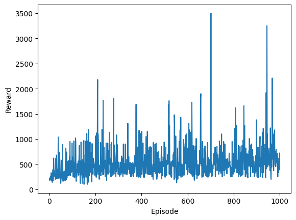
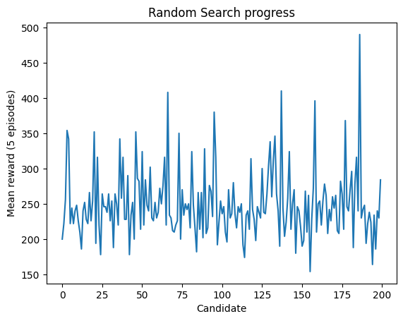
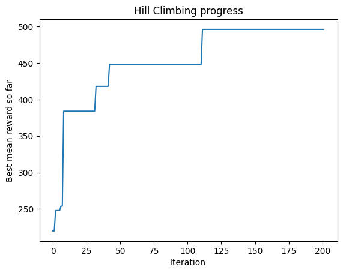
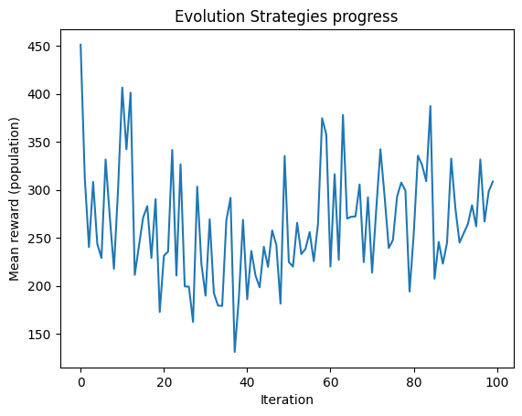

# Reinforcement Learning on Atari Ms. Pac-Man 🎮

This project explores **different Reinforcement Learning (RL) algorithms** applied to the classic Atari game **Ms. Pac-Man** using the [Gymnasium Atari](https://gymnasium.farama.org/) environments.

We implement, train, and compare several strategies:
- **Policy Gradient (REINFORCE)**
- **Random Search**
- **Hill Climbing**
- **Evolution Strategies**

## Project Goals 
1. Train an agent to play Ms. Pac-Man using various RL algorithms.
2. Visualize the training process (reward curves).
3. Record gameplay videos of the best episodes.
4. Compare algorithm performance and explain why some methods perform poorly.

## 📈 Training Curves

  <table>
    <tr>
      <td align="center">
        <b>Policy Gradient (REINFORCE)</b> 
        
      </td>
      <td align="center">
        <b>Random Search</b> 
        
      </td>
    </tr>
    <tr>
      <td align="center">
        <b>Hill Climbing</b> 
        
      </td>
      <td align="center">
        <b>Evolution Strategies</b> 
        
      </td>
    </tr>
  </table>

> Curves show episode rewards over training steps for each algorithm.
