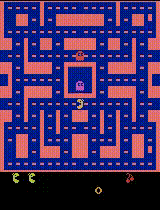

# Reinforcement Learning on Atari Ms. Pac-Man 🎮

This project explores **different Reinforcement Learning (RL) algorithms** applied to the classic Atari game **Ms. Pac-Man** using the [Gymnasium Atari](https://gymnasium.farama.org/) environments.

We implement, train, and compare several strategies:
- **Policy Gradient (REINFORCE)**
- **Random Search**
- **Hill Climbing**
- **Evolution Strategies**

## Project Goals 
1. Train an agent to play Ms. Pac-Man using various RL algorithms.
2. Visualize the training process (reward curves).
3. Record gameplay videos of the best episodes.
4. Compare algorithm performance and explain why some methods perform poorly.

## 📈 Training Curves

  <table>
    <tr>
      <td align="center">
        <b>Policy Gradient (REINFORCE)</b> 
        
      </td>
      <td align="center">
        <b>Random Search</b> 
        
      </td>
    </tr>
    <tr>
      <td align="center">
        <b>Hill Climbing</b> 
        
      </td>
      <td align="center">
        <b>Evolution Strategies</b> 
        
      </td>
    </tr>
  </table>

> Curves show episode rewards over training steps for each algorithm.

## 🎮 Gameplay Examples

  <table>
    <tr>
      <td align="center">
        <b>Policy Gradient (REINFORCE)</b> 
        
      </td>
      <td align="center">
        <b>Random Search</b> 
        
      </td>
    </tr>
    <tr>
      <td align="center">
        <b>Hill Climbing</b> 
        
      </td>
      <td align="center">
        <b>Evolution Strategies</b> 
        
      </td>
    </tr>
  </table>

> Animated gameplay examples for each algorithm.

## Conclusions

1. **Random Search**  
   – Average reward stays around 200–300.  
   – Behavior is highly random, with no improvements over time.  
   – Not suitable for stable policy learning.  

2. **Hill Climbing**  
   – Reward gradually increases but quickly hits a “ceiling” (~500).  
   – Performs better than random search but gets stuck in a local maximum.  
   – Can only be used as a simple heuristic.  

3. **Policy Gradient (REINFORCE)**  
   – Average rewards are higher than with random search and Hill Climbing.  
   – The learning curve is noisy, with many fluctuations.  
   – Occasionally achieves high scores (3000+), but cannot sustain them.  

4. **Evolution Strategies**  
   – Results are unstable, with rewards around 200–300.  
   – Worse than Hill Climbing and Policy Gradient.  

**Conclusion:** among the implemented approaches, the best was the **Policy Gradient method (REINFORCE)** — despite its noisiness, it can discover strategies that yield significantly higher rewards than simple evolutionary or random methods.  
